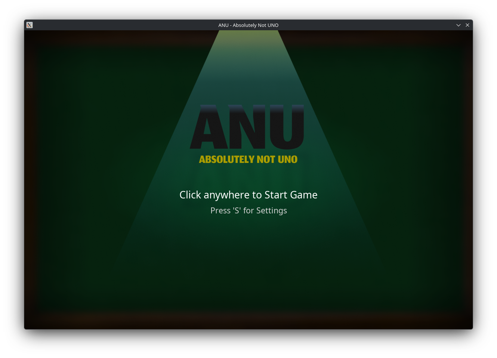
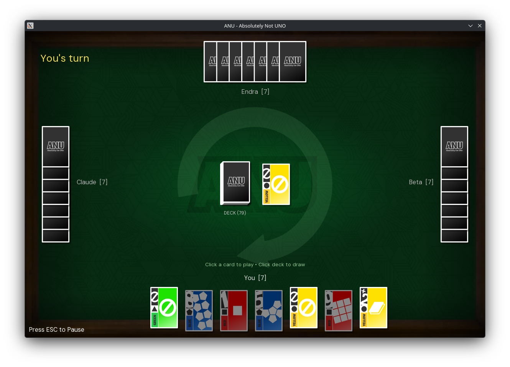

# 🃏 ANU - Absolutely Not UNO
ANU - Absolutely Not UNO adalah sebuah implementasi digital dari permainan kartu klasik UNO yang dibangun menggunakan bahasa pemrograman Python dan library **Arcade**. Game ini menghadirkan pengalaman bermain yang interaktif dengan antarmuka grafis (GUI) 2D yang mulus, sistem *bot/CPU* yang cerdas untuk mode *single-player*, serta integrasi audio dinamis yang memberikan nuansa permainan layaknya game profesional. Project ini dikembangkan sebagai bentuk implementasi nyata dari konsep *Object-Oriented Programming* (OOP) dalam pengembangan perangkat lunak.

## Anggota Kelompok
* Nikolas Tiar Banjarnahor - [25051204056]
* Muhammad Nur Fajri - [25051204016]
* Talitha Zahra Anabela Putri - [25051204064]
* Habibi - [25051204058]

## Fitur Utama
* insert here
* insert here

## Cara Menjalankan Project
### Prasyarat
* Python 3.12+
* pip

### Langkah-Langkah Menjalankan
* Clone/Download repository ini.
* Buka Terminal/Command Prompt dan arahkan ke folder repository.
* Buat dan aktifkan Virtual Enviroment.
    ```
    python -m venv .venv
    # Linux/macOS
    source .venv/bin/activate
    # Windows (Command Prompt)
    .venv\Scripts\activate.bat
    # Windows (Powershell)
    .venv\Scripts\Activate.ps1
    ```
* Install library Arcade.
    ```bash
    pip install arcade
    ```
* Jalankan main.py
    ```
    python main.py
    ```
## Penjelasan Implementasi OOP
### 1. Encapsulation
Lorem ipsum dolor sit amet, consectetur adipiscing elit. Donec augue tortor, varius id pretium eget, pretium eget justo.
### 2. Inheritence
Lorem ipsum dolor sit amet, consectetur adipiscing elit. Donec augue tortor, varius id pretium eget, pretium eget justo.
### 3. Abstraction 
Lorem ipsum dolor sit amet, consectetur adipiscing elit. Donec augue tortor, varius id pretium eget, pretium eget justo.
### 4. Polymorphism
Lorem ipsum dolor sit amet, consectetur adipiscing elit. Donec augue tortor, varius id pretium eget, pretium eget justo.

## Screenshots

