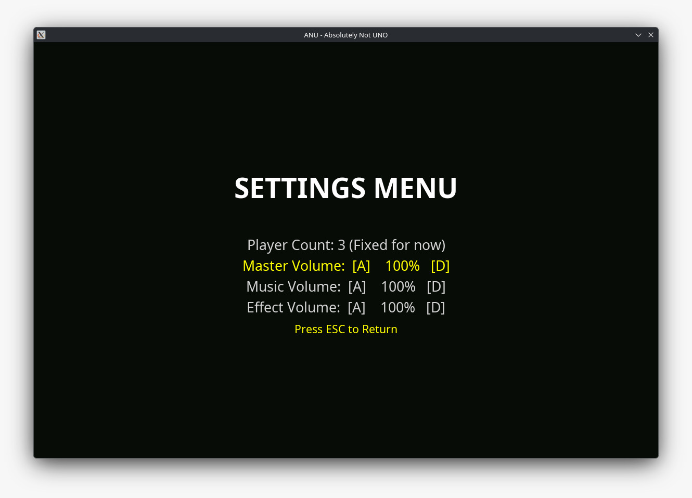

# 🃏 ANU - Absolutely Not UNO
ANU - Absolutely Not UNO adalah sebuah implementasi digital dari permainan kartu klasik UNO yang dibangun menggunakan bahasa pemrograman Python dan library **Arcade**. Game ini menghadirkan pengalaman bermain yang interaktif dengan antarmuka grafis (GUI) 2D yang mulus, sistem *bot/CPU* yang cerdas untuk mode *single-player*, serta integrasi audio dinamis yang memberikan nuansa permainan layaknya game profesional. Project ini dikembangkan sebagai bentuk implementasi nyata dari konsep *Object-Oriented Programming* (OOP) dalam pengembangan perangkat lunak.

## Anggota Kelompok
* Nikolas Tiar Banjarnahor - [25051204056]
* Muhammad Nur Fajri - [25051204016]
* Talitha Zahra Anabela Putri - [25051204064]
* Habibi - [25051204058]

## Fitur Utama
* Play Card - Pemain dapat memainkan kartu di tangan sesuai warna dan angkanya.
* Draw Card - Pemain dapat mengambil kartu di deck jika kekurangan kartu.
* Switcheroo - Pemain dapat mengganti warna kartu di secara bebas.
* Skip - Pemain dapat melompati giliran pemain setelahnya
* Reverse - Pemain dapat memutar arah giliran permainan.
* +2 dan +4 - Pemain dapat memberikan 2 atau 4 kartu kepada pemain setelahnya.

## Cara Menjalankan Project
### Prasyarat
* Python 3.12+
* pip

### Langkah-Langkah Menjalankan
* Clone/Download repository ini.
* Buka Terminal/Command Prompt dan arahkan ke folder repository.
* Buat dan aktifkan Virtual Enviroment.
    ```
    python -m venv .venv
    # Linux/macOS
    source .venv/bin/activate
    # Windows (Command Prompt)
    .venv\Scripts\activate.bat
    # Windows (Powershell)
    .venv\Scripts\Activate.ps1
    ```
* Install library Arcade.
    ```bash
    pip install arcade
    ```
* Jalankan main.py
    ```
    python main.py
    ```
## Penjelasan Implementasi OOP
### 1. Encapsulation
Enkapsulasi diterapkan dalam GameplayView, semua method gameplay hanya bisa diakses oleh class GameplayView.
Player tidak mengubah jumlah dari kartu yang dimainkan secara langsung, namun sistem akan memerintahkan method untuk mengurangi atau menambah jumlah kartu dari pemain.
### 2. Inheritence
Penerapan inheritance ada pada setiap view. Tampilan game memakai turunan dari class view bawaan Arcade.
### 3. Abstraction 
Class view bawaan Arcade adalah sebuah class Abstract, hal ini membuat penerapan abstraction juga berada pada tiap view yang ada di dalam game ini.
### 4. Polymorphism
Beberapa method seperti on_draw dan on_key_pressed pada beberapa class memiliki perintah yang berbeda walaupun menggunakan nama yang sama. 

## Screenshots


